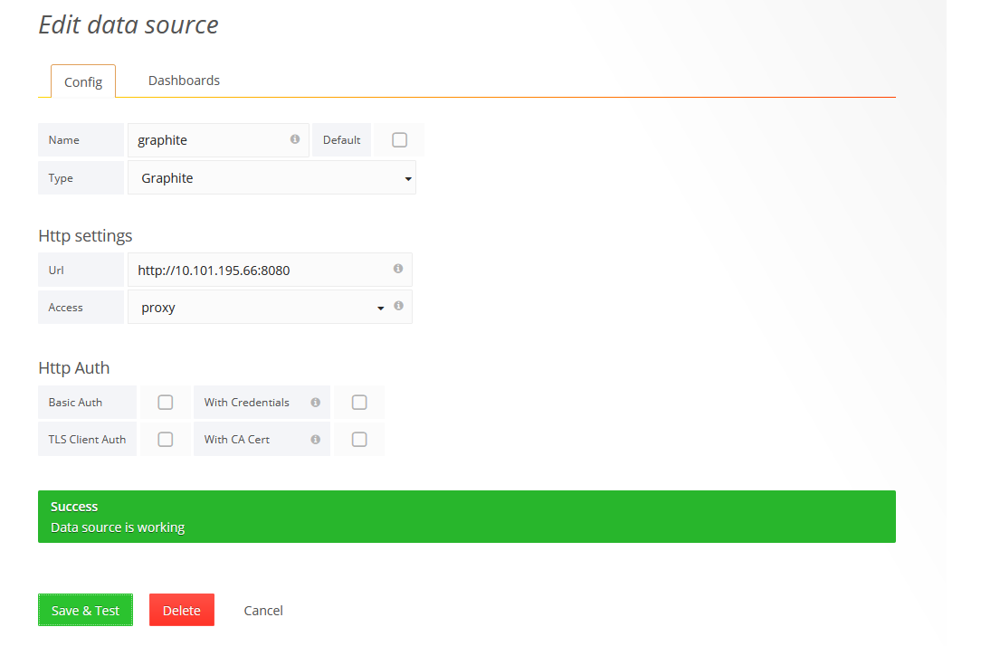
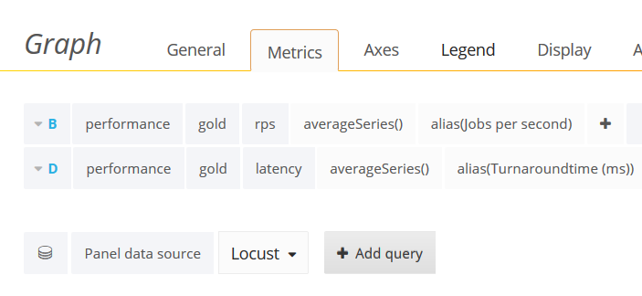
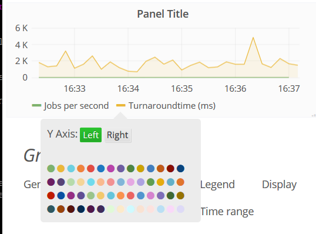
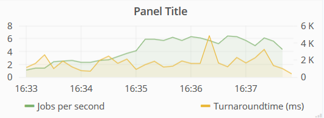
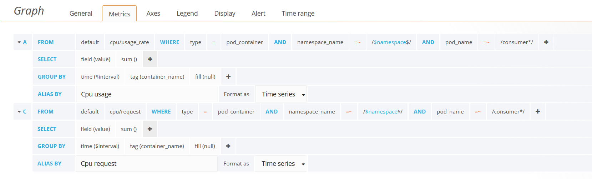
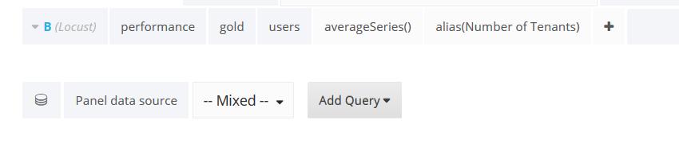

# Prerequisites

Given the following cluster setup 
```
$ kubectl get nodes --show-labels
k8-test-1   Ready    master   56d   v1.14.1   beta.kubernetes.io/arch=amd64,beta.kubernetes.io/os=linux,kubernetes.io/arch=amd64,kubernetes.io/hostname=k8-test-1,kubernetes.io/os=linux,node-role.kubernetes.io/master=
k8-test-2   Ready    <none>   56d   v1.14.1   beta.kubernetes.io/arch=amd64,beta.kubernetes.io/os=linux,kubernetes.io/arch=amd64,kubernetes.io/hostname=k8-test-2,kubernetes.io/os=linux,workerNode=yes
k8-test-3   Ready    <none>   56d   v1.14.1   beta.kubernetes.io/arch=amd64,beta.kubernetes.io/os=linux,kubernetes.io/arch=amd64,kubernetes.io/hostname=k8-test-3,kubernetes.io/os=linux,monitoringNode=yes
```

Note the following node labels:
* On the monitoringNode heapster, grafana, influxdb and graphite are deployed
* On the workerNode the scaler-controller, exp2app and bronze charts are deployed. It should have at least 8 CPU cores. Otherwise add the `workerNode="yes"` label to other nodes as well

# Install locust on the master node using pip3

pip3 requires python3

```
$ pip3 install locust
```

Add locust to your PATH by adding the following line to your .bashrc or .bash_profile file

```
export PATH=$PATH:$HOME/.local/bin
```

# Install helm


Install helm

```bash
curl -fsSL -o get_helm.sh https://raw.githubusercontent.com/helm/helm/master/scripts/get-helm-3
chmod +x get_helm.sh
```

# Install the python-based application

```
#install golden SLA-class
$ kubectl create ns gold
$ helm install gold-app charts/exp2app -n gold

#install bronzen SLA-class
$ kubectl create ns bronze
$ helm install bronze-app charts/bronze -n bronze
```
You need to install both the golden and bronze SLA class even if you only want to do an experiment with only one of these. This is due to some bad coding in the current prototype

# Install the scaler

```
kubectl create ns scaler
helm install scaler-app charts/scaler-controller -n scaler

```
Set the appropriate matrix in the resource planner pod

```
$ kubectl get pods -n scaler
NAME                              READY   STATUS    RESTARTS   AGE
go-deployer-58bb7c4c49-tg5c9      1/1     Running   6          61m
rabbitmq-7b944bfdf4-wsltc         1/1     Running   0          61m
resource-planner-589d79bf-sh6pp   1/1     Running   0          61m
$ kubectl exec -it resource-planner-589d79bf-sh6pp -n scaler -- sh
/ # vi server.py
```

Edit in server.py the following line
```
config_data = yaml.safe_load(open('data/matrix.yaml'))^M
```
`/data/matrix.yaml` is the matrix for heterogeneous scaling of the gold namespace while `/data/single-replica.yaml` is for homogeneous scaling. `/data/bronze.yaml` is the matrix for heterogeneous scaling of the golden and bronze namespace.
The values in the matrix have been determined by the resource planner using the k8s-resource-optimizer tool.


# Install graphite

```
$ helm install graphite charts/graphite 
```
It logs the results of the experiments. To push metrics, two different endpoints are available, one for discrete data and the other for aggregated data.

# Install Heapster, Grafana and InfluxDB

First delete any old heapster configurations that have been deployed by kubeadm

```
kubectl delete sa system:heapster -n kube-system
kubectl delete clusterrole system:heapster
```
Then install the following helm chart in the kube-system namespace  

```
helm install heapster heapster-grafana-influxdb/ -n kube-system
```

To display graphite metrics on Grafana dashboard, log into the dashboard and [add graphite as data source](https://grafana.com/docs/grafana/latest/features/datasources/graphite/). Just replace localhost with the ClusterIP of the graphite service, and select the Proxy mechanism. 


Then you have to import the Carbon Graphite daskboard by clicking on the Import dashboard button.

This deployment does not implement any persistance mechanism, so all data is going to be lost on cluster failure. [Persistent Volumes](https://kubernetes.io/docs/concepts/storage/persistent-volumes/)
can be used to avoid this (see charts/graphite/templates/volume.yaml)


# Start the locust server

For generating local files with throughput and turnaround time, `Locust/locustfile-exp1.py` can be used. The socket connection (self.sock.connect(IP, port)) needs to match the graphite aggregator service (running by default on nodePort 30688).

To get metrics of the locust test into the graphite server ...

 * Edit `Locust/locustfile-exp1.py` to replace the IP of the queue host on the HttpLocust class for your queue endpoint.
 * Update the IP-address of the Locust service and the graphite service in `metrics.py`
 * Run:

```
locust -f Locust/locustfile-exp1.py
```

 * Open the browser at http://127.0.0.1:8089


 * Run in a separate terminal run:

```
cd ../apps/workload-generator
python3 metrics.py
```

This script is going to fetch metrics from the current run using the Locust API and push them to the graphite host. Modify the SLA class and graphite endpoint if needed.


## Troubleshooting missing modules in metrics.py
Note metrics.py requires the aiohttp module that is not supported anymore in python3.5. This gives problems if the Locust program is installed for python3.5.
The solution is to use virtual environments.

First check your python3 version

```
readlink -f $(which python3) | xargs -I % sh -c 'echo -n "%: "; % -V'
```
If  the installed pyton version is 3.6 or more, just install the missing package, run metrics.py and skip the rest of the instructions and go directly to the [workload generation](#start-the-workload-generator):

```
pip3 install aiohttp
python3 metrics.py
```

If the installed python version is 3.5 or less, install python3.6 as follows:

```
sudo apt update
sudo apt install software-properties-common
sudo add-apt-repository ppa:deadsnakes/ppa  
sudo apt update
sudo apt install python3.6
```

Then install a separate pip3 version in a virtual environement:
```
#in directory apps/workload-generator
python3.6 -m venv env --without-pip
source env/bin/activate
curl https://bootstrap.pypa.io/get-pip.py | python3.6
pip3 install aiohttp
python3 metrics.py
```


# Start the workload generator
First modify the IP address of the master node in apps/workload-generator/generator.py

```
cd ../apps/workload-generator
python3 generator.py start -f thesis/seasonal.yaml --host=http://172.17.13.106:8089
```

The above tests a seasonal workload

# Visualize the Graphite metrics in Grafana

## Prerequisites
* You have started locust with the file [Locust/locustfile-exp1.py](Locust/locustfile-exp1.py).

* You have [added graphite as a data source](https://grafana.com/docs/grafana/latest/features/datasources/graphite/). Just replace localhost with the ClusterIP of the graphite service, and select the Proxy mechanism. 

* You have imported the Carbon graphite dashboard  

The metrics of graphite are available under performance.gold


## User flow

* Open grafana in your browser at nodeport 30345
* Left-Click on the Graphite Carbon Metrics Dashboard
* Left-Click on the one of the Panels or add a new Panel
* Left-Click on the Edit menu
* The Metrics menu appears
* Remove any metrics 
* Choose as Panel data source: Locust
* Left click add query
* Add the following queries: 
* The metrics need to be displayed at different scales. To do this, click in Legend of the planel on the colored line besides the metric that needs to move to the right Y-axis:  


* Go to the Pods dashboard, but first save the changes to the GraphiteMetrics dashboard
* Go to the gold namespace of the CPU usage panel
* Adapt the Metrics of the CPU panel as follows: 
* Select the mixed datasource to add the number of users as follows: 
* Move the number of tenants metrics to the right Y-axis as above: )
```


Start the locus server with another file

```
locust -f Locust/locustfile-exp2.py
```

And run the `generate.py` program with a file from the `apps/workload-generator/exp2/` directory

For adding the Graphite metrics of the bronze app to Grafana, repeat the same steps for the Pod panel of the bronze namespace.

# More information:
* https://grafana.com/docs/grafana/latest/features/panels/graph/
* https://community.grafana.com/t/consolidate-data-from-multiple-datasources-sites-on-same-graph-panel/2496/2
* https://community.grafana.com/t/can-i-have-two-different-units-for-y-axis/696
* https://community.grafana.com/t/getting-line-connected-points-over-a-series/164


